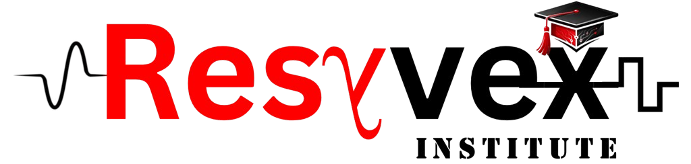

# Resyvex Institute - SEO Implementation Guide

## Overview
This document outlines all the SEO optimizations that have been implemented on the Resyvex Institute website and recommendations for further improvements.

---

## ✅ Implemented SEO Optimizations

### 1. **Meta Tags & Headers**
- ✅ Unique meta descriptions (150-160 characters) on all 11 pages
- ✅ Relevant meta keywords targeting electronics, embedded systems, PCB design
- ✅ Author and robots meta tags set to "index, follow"
- ✅ Canonical tags on all pages to prevent duplicate content
- ✅ UTF-8 character encoding specified

**Pages Updated:**
- index.html, about.html, courses.html, workshop.html, guidance.html
- contact.html, placements.html, student-support.html, careers.html
- terms.html, privacy.html

### 2. **Open Graph Tags**
- ✅ og:title, og:description, og:type, og:url, og:image on all pages
- ✅ Enables proper social media sharing with rich previews
- ✅ Consistent image (logo.png) across all pages

### 3. **Twitter Card Tags**
- ✅ twitter:card (summary_large_image)
- ✅ twitter:title, twitter:description, twitter:image
- ✅ Improves appearance when shared on Twitter/X

### 4. **Structured Data (Schema.org)**
- ✅ **Organization Schema** (index.html) - Defines company information, contact details, address
- ✅ **EducationalOrganization Schema** (index.html) - Highlights educational nature
- ✅ **LocalBusiness Schema** (contact.html) - Maps location, phone, hours, ratings
- ✅ **Course Schema** (courses.html) - Describes course offerings
- ✅ **BreadcrumbList Schema** (courses.html) - Navigation hierarchy for rich snippets

### 5. **XML Sitemap**
- ✅ Created sitemap.xml with all 11 pages
- ✅ Proper priority levels:
  - Homepage: 1.0 (highest)
  - Courses: 0.95
  - Workshop: 0.9
  - About/Guidance/Placements: 0.85-0.9
  - Support/Contact: 0.8
  - Legal pages: 0.5 (lowest)
- ✅ Update frequency specified (weekly for dynamic pages, monthly/yearly for static)
- ✅ Last modified dates included

### 6. **Robots.txt**
- ✅ Created robots.txt with proper directives
- ✅ Allows crawling of all public pages
- ✅ Disallows admin, private, and duplicate content paths
- ✅ Specifies sitemap location
- ✅ Crawl-delay: 1 second for polite crawling
- ✅ Google and Bing bot specific rules

### 7. **Performance Optimization (.htaccess)**
- ✅ GZIP compression for text/CSS/JavaScript files
- ✅ Browser caching with expiration headers:
  - CSS: 1 month
  - JavaScript: 1 month
  - Images: 1 year
  - Fonts: 1 year
  - HTML: 1 hour
- ✅ Proper MIME type configuration
- ✅ Directory listing disabled
- ✅ Security headers configured (X-Frame-Options, X-Content-Type-Options)

### 8. **Page Titles**
- ✅ Unique, descriptive titles (50-60 characters) on all pages
- ✅ Include primary keyword + brand name
- ✅ Action-oriented where appropriate

**Examples:**
- "Courses - Resyvex Institute"
- "Free Guidance & Career Counseling - Resyvex Institute"
- "Workshops & Hands-On Training - Resyvex Institute"

### 9. **URL Structure**
- ✅ Clean, semantic URLs (no query parameters)
- ✅ Lowercase, hyphenated (e.g., /student-support.html)
- ✅ Descriptive page names reflecting content

### 10. **Mobile Responsiveness**
- ✅ Viewport meta tag set
- ✅ Responsive CSS grid system
- ✅ Mobile-first design approach

---

## 📋 SEO Checklist for Ongoing Optimization

### Content Optimization
- [ ] Ensure all image alt attributes are descriptive (currently checking)
- [ ] Add schema.org markup to individual course cards
- [ ] Create FAQ schema markup for FAQ sections
- [ ] Optimize heading hierarchy (H1 for main, H2/H3 for subsections)
- [ ] Target long-tail keywords in content
- [ ] Aim for 300+ words per page (exclude legal pages)
- [ ] Use target keywords in first 100 words

### Technical SEO
- [ ] Verify robots.txt is accessible at https://resyvexinstitute.com/robots.txt
- [ ] Submit sitemap.xml to Google Search Console
- [ ] Submit sitemap.xml to Bing Webmaster Tools
- [ ] Enable SSL/HTTPS (critical for SEO)
- [ ] Set up 301 redirects for any old URLs
- [ ] Monitor Core Web Vitals
- [ ] Set preferred domain (www vs non-www) in Search Console
- [ ] Implement schema markup for breadcrumbs on all pages

### Link Building
- [ ] Create high-quality backlinks from educational directories
- [ ] Get listed on Indian education portals
- [ ] Build relationships with electronics blogs/websites
- [ ] Create shareable content/infographics
- [ ] Guest posting on relevant industry blogs

### Local SEO
- [ ] Register on Google Business Profile
- [ ] Register on Google Maps
- [ ] Get listed on local business directories
- [ ] Ensure NAP (Name, Address, Phone) consistency across all platforms
- [ ] Collect and respond to customer reviews

### Content Strategy
- [ ] Start a blog with industry insights
- [ ] Create tutorials on electronics/embedded systems
- [ ] Publish case studies of student success stories
- [ ] Create downloadable resources (guides, checklists)
- [ ] Develop video content for YouTube

### Analytics & Monitoring
- [ ] Install Google Analytics 4
- [ ] Set up Google Search Console
- [ ] Set up Bing Webmaster Tools
- [ ] Monitor keyword rankings
- [ ] Track organic traffic
- [ ] Analyze user behavior (bounce rate, time on page)
- [ ] Monitor crawl errors and fix promptly

---

## 🔍 Next Steps

### Priority 1 (High Impact)
1. **Enable HTTPS/SSL** - Most critical ranking factor
2. **Submit to Search Consoles** - Google and Bing
3. **Create Google Business Profile** - For local search visibility
4. **Optimize Images** - Add descriptive alt text, compress, lazy load
5. **Build Quality Backlinks** - From education/tech sites

### Priority 2 (Medium Impact)
1. **Create SEO-optimized Blog** - Target long-tail keywords
2. **Implement Breadcrumb Schema** - On all pages
3. **Create FAQ Schema** - For featured snippets
4. **Set up Analytics** - Track performance
5. **Internal Link Optimization** - Link related pages

### Priority 3 (Ongoing)
1. **Regular Content Updates** - Keep information fresh
2. **Monitor Rankings** - Track keyword positions
3. **Competitive Analysis** - Stay ahead of competitors
4. **User Experience** - Improve page speed, usability
5. **Community Building** - Engage on social media

---

## 📊 Key SEO Metrics to Monitor

1. **Organic Traffic** - Sessions from organic search
2. **Keyword Rankings** - Position in SERPs for target keywords
3. **Click-Through Rate (CTR)** - % of impressions that result in clicks
4. **Average Position** - Average ranking for target keywords
5. **Impressions** - Total times in search results
6. **Backlinks** - Quality and quantity of links pointing to site
7. **Domain Authority** - Overall site authority (0-100 scale)
8. **Page Speed** - Core Web Vitals (LCP, FID, CLS)
9. **Bounce Rate** - % of single-page sessions
10. **Conversion Rate** - % of visitors completing desired actions

---

## 🎯 Target Keywords

### Primary Keywords
- Electronics courses
- Embedded systems training
- PCB design course
- Online electronics certification
- Professional electronics education

### Secondary Keywords
- Electronics workshop
- Microcontroller training
- FPGA programming
- Arduino course
- IoT training
- Career guidance electronics
- Placement assistance

### Long-tail Keywords
- "best electronics courses online"
- "embedded systems certification"
- "PCB design training India"
- "free electronics workshops"
- "career counseling for engineers"

---

## 🔗 Important Files Created

1. **robots.txt** - Search engine crawler directives
2. **sitemap.xml** - Complete site structure and priority
3. **.htaccess** - Server configuration for performance and SEO
4. **SEO-CHECKLIST.md** - This document (ongoing reference)

---

## 📞 SEO Resources for Further Optimization

- **Google Search Central**: https://developers.google.com/search
- **Google PageSpeed Insights**: https://pagespeed.web.dev/
- **Schema.org Documentation**: https://schema.org/
- **Mobile-Friendly Test**: https://search.google.com/test/mobile-friendly
- **Rich Results Test**: https://search.google.com/test/rich-results
- **Yoast SEO Guide**: https://yoast.com/seo/
- **Moz Learning Center**: https://moz.com/learn/seo

---

## ✨ Quick Wins (Can be implemented immediately)

1. **Image Optimization**
   ```html
   <!-- Add descriptive alt text to all images -->
   
   ```

2. **Heading Optimization**
   ```html
   <!-- Ensure H1 is used only once per page for main topic -->
   <h1>Courses - Professional Electronics Education</h1>
   ```

3. **Internal Linking**
   ```html
   <!-- Link related pages to improve SEO and user navigation -->
   <a href="courses.html">Explore our professional courses</a>
   <a href="guidance.html">Get career guidance</a>
   ```

4. **Page Load Speed**
   - Compress images to reduce file size
   - Minify CSS/JavaScript
   - Enable lazy loading for images
   - Use CDN for static assets

5. **User Experience**
   - Clear call-to-action buttons
   - Easy navigation
   - Mobile-friendly design
   - Fast page load times

---

**Last Updated:** April 26, 2026
**Next Review:** Monthly
